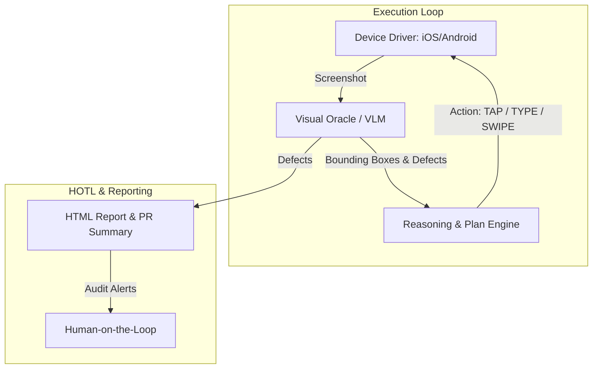

# Autonomous Mobile GUI QA & Loop Engineering Architecture

## 1. System Overview

Autonomous GUI QA replaces brittle assertion-based mobile testing with **Vision-Language Model (VLM) Oracles** and **Autonomous Agents (Perceive -> Reason -> Act)**.

## 2. Core Concepts

### 2.1 Visual Oracle
- Uses Multimodal LLMs (Gemini 2.5 Flash/Pro, Claude 3.7 Sonnet, GPT-4o) with structured JSON Schema output.
- Checks for text truncation, layout overlap, contrast degradation, and semantic contradictions.

### 2.2 Device Operator
- Operates at normalized (0-1000) coordinate space.
- Translates coordinates to native OS events via AppleScript / `xcrun simctl` on macOS or `adb` on Android.

### 2.3 Self-Healing & Loop Engineering
- **Phase 1: Perception & Defect Detection**
- **Phase 2: Automated Code Remediation (Subagent / LLM)**
- **Phase 3: Re-compilation & Dynamic Re-verification**
